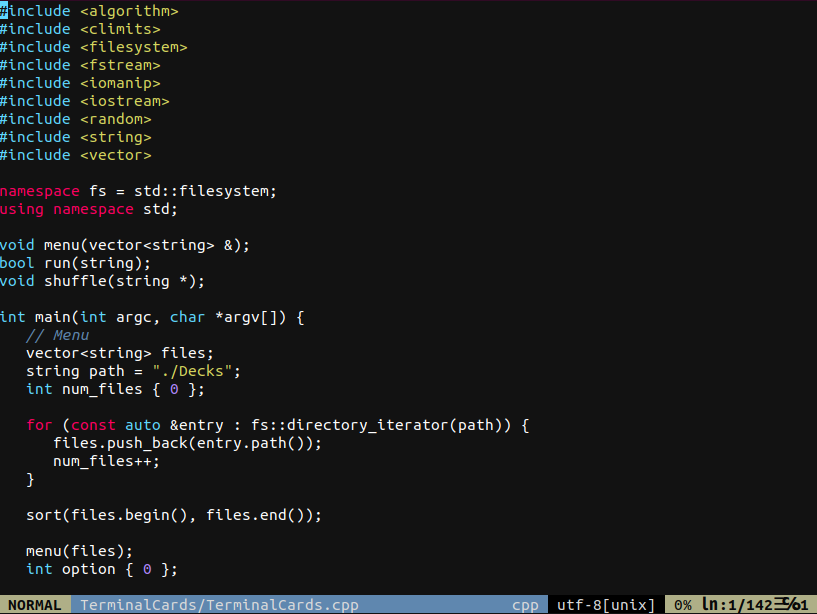

# vimrc

## Description
My vimrc configuration

Run setup.sh to pop it in

My config uses
- [vim-plugins](https://github.com/junegunn/vim-plug)
- [vim-awesome](https://vimawesome.com/)
- [Colors](https://github.com/Reewr/vim-monokai-phoenix/blob/master/colors/monokai-phoenix.vim)
